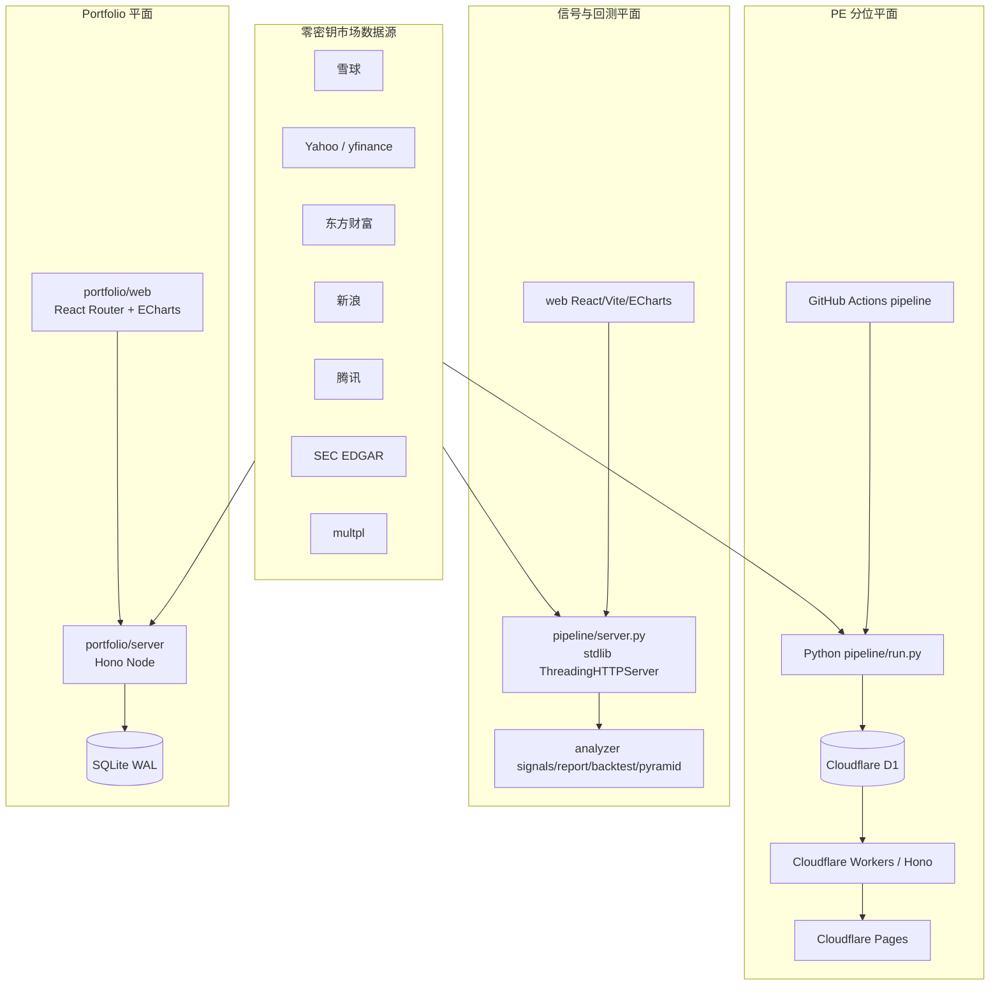

# stock-farmer 项目 Wiki

> 面向维护者、贡献者与部署人员的架构与业务说明。
>
> **分析基线**：提交 `ea4b727`（2026-08-19）
>
> **事实来源**：当前源码、`README.md`、`AGENTS.md`、`CLAUDE.md`、`db/schema.sql`、`deploy/`、`portfolio/deploy/`、`.github/workflows/`、`openspec/` 与仓库内 `SKILL.md`。源码与历史文档不一致时，本文以当前源码为准，并在“架构边界与已知偏差”中说明。
>
> **验证基线**：以本文对应代码的最新测试输出为准；筑底体系变更后 Python 测试已重新收敛，Cloudflare API 与 Portfolio 不受本变更影响。

---

## 目录

1. [项目概述](#1-项目概述)
2. [系统架构](#2-系统架构)
3. [技术栈](#3-技术栈)
4. [核心功能详解](#4-核心功能详解)
5. [数据结构与存储](#5-数据结构与存储)
6. [API 与模块交互](#6-api-与模块交互)
7. [部署与运维](#7-部署与运维)
8. [开发者指南](#8-开发者指南)
9. [架构边界与已知偏差](#9-架构边界与已知偏差)
10. [关键文件索引](#10-关键文件索引)

---

# 1. 项目概述

## 1.1 项目目标

`stock-farmer` 是一个面向港股、美股个人投资者的研究与资产管理工具集，核心目标不是自动交易，而是把以下低频但高认知负担的工作结构化：

1. **估值定位**：判断当前 PE-TTM 在标的自身 5 年、10 年或全部历史中的位置。
2. **筑底结构诊断**：把缩量下跌、假破位收回、筹码稳定三迹象计算成可解释的筑底档位和结构强度。
3. **历史证伪与纪律推演**：使用 as-of 截断检查历史时点判断；金字塔模块由用户手动选择决策日，只推演仓位纪律，不自动判断买点。
4. **投资组合管理**：汇总多券商月结单、现金、持仓、交易和资本事件，计算绩效、风险额度、加减仓计划与月度复盘。

项目强调：

- 结果用于**研究、观察和人工决策辅助**，不构成投资建议。
- 洗盘干净度是唯一主分数，语义为**筑底结构强度**，不是胜率、概率、准确率或买点。
- PE 产品使用最新可得财报口径，不还原完整 Point-in-Time 财务数据。
- 历史信号和金字塔回测必须防止未来数据泄漏。

## 1.2 当前产品面

当前仓库实际包含三个相对独立的产品/部署平面：

| 产品面 | 用户价值 | 主要模块 | 运行位置 |
|---|---|---|---|
| PE-TTM 历史分位观察站 | 判断“相对自身历史贵不贵” | `pipeline/run.py`、`db/schema.sql`、`api/`、PE React 组件 | GitHub Actions + Cloudflare D1/Workers/Pages |
| 筑底结构诊断与纪律推演 | 诊断筑底三迹象；历史证伪；手动决策日金字塔推演 | `pipeline/analyzer/`、`pipeline/server.py`、`web/` | 本地或 VPS Docker，Python 实时计算 |
| Portfolio 资产与资本控制中心 | 汇总多券商资产，维护账本、绩效、风险和加减仓计划 | `portfolio/server/`、`portfolio/web/` | 本地或 VPS Docker，Node + SQLite |

此外，`pipeline/analyze.py` 与 `.github/workflows/analyze.yml` 支持生成单票静态 HTML 报告并发布到 `gh-pages`。

## 1.3 核心使用场景

### 研究标的

- 输入 `AAPL`、`0700.HK` 等 ticker 查看 PE 历史分位。
- 查看 6 项结构证据和“筑底三迹象”：缩量下跌、假破位收回、筹码稳定。
- 查看筑底档位与洗盘干净度；左侧证据不再聚合成第二套总分。
- 选择历史日期，以当时可见数据复盘判断，并查看仅用于证伪的后续收益标签。

### 验证交易纪律

- 选择标的和 as-of 手动决策日，模拟次日开盘首仓、加仓、停买、减仓和止损。
- 查看每笔成交、事件、逐日账本、净成本和窗口末未平仓估值。
- 使用筑底历史证伪镜观察当时结构与后续价格；旧入场标准实验室已删除。

### 管理投资组合

- 在浏览器本地解析多家券商 PDF/XLS/XLSX 月结单；文件与密码不上传，服务器只接收结构化结果。
- 汇总多券商持仓、现金、货币基金、手动交易和成本覆盖情况。
- 区分进取仓、防守仓、稳健仓、授予仓，查看自主组合或全部资产。
- 计算外部净投入、经济盈亏、解释盈亏、单位净值、回撤和已平仓统计。
- 设置单标的上限、单仓上限、现金底线和季度仓预算，计算安全加仓金额。
- 创建金字塔加仓/减仓计划、比较场景并记录档位执行状态。

---

# 2. 系统架构

## 2.1 总体架构



三个平面共享仓库、设计语言和部分数据源理念，但**不共享运行时数据库**：

- PE 平面使用 Cloudflare D1。
- 信号/回测平面实时抓取数据，默认无业务数据库。
- Portfolio 平面使用独立 SQLite，保存用户、快照、账本、计划和绩效数据。

## 2.2 模块职责

| 模块 | 职责 | 主要入口 |
|---|---|---|
| `pipeline/fetcher/` | PE 历史、价格、EPS、宏观数据抓取与 ticker 转换 | `prices.py`、`eps.py`、`xueqiu.py`、`sec_facts.py`、`macro.py` |
| `pipeline/data/` | 统一行情接口、数据源路由、故障降级、代理池、指标与成交密集区 | `data/__init__.py`、`router.py`、`indicators.py` |
| `pipeline/compute/` | TTM EPS、PE、滚动历史分位 | `ttm.py`、`pe.py`、`percentile.py` |
| `pipeline/db/` | Cloudflare D1 HTTP 客户端、幂等写入、fetch_log | `d1_client.py`、`writers.py`、`fetch_log.py` |
| `pipeline/analyzer/` | 六项结构证据、筑底判读、报告、as-of 复盘、手动决策日金字塔推演、静态渲染 | `signals.py`、`bottoming.py`、`report.py`、`backtest.py`、`pyramid.py` |
| `pipeline/run.py` | PE 离线流水线，按 watchlist/市场调度并写 D1 | `main()` |
| `pipeline/analyze.py` | 单票实时分析并输出静态 HTML | `analyze()` |
| `pipeline/server.py` | 信号报告、金字塔回测、入场扫描 API；可同源托管 `web/dist` | `SignalReportHandler` |
| `api/` | Cloudflare Workers 薄 API，主要读取 D1，并 best-effort 获取实时雪球报价 | `api/src/index.ts` |
| `web/` | 当前主入口为筑底结构报告与金字塔纪律推演；保留 PE 图表和 watchlist 组件 | `web/src/App.tsx` |
| `portfolio/server/` | Hono Node API、认证、SQLite、账本、资产汇总、绩效、风险、计划、行情 | `src/index.ts`、`src/app.ts` |
| `portfolio/web/` | 资产总览、绩效、复盘、持仓、现金流、计划、观察、笔记和数据管理 | `src/App.tsx` |
| `db/` | Cloudflare D1 schema 和 watchlist seed | `db/schema.sql` |
| `deploy/` | 信号/回测应用的 Python + React 单容器部署 | `Dockerfile`、`docker-compose.yml` |
| `portfolio/deploy/` | Portfolio Node + React + SQLite 单容器部署 | `Dockerfile`、`docker-compose.yml` |
| `openspec/` | Spec-Driven Development 变更工件与主规格 | `changes/`、`specs/` |

## 2.3 三条主要数据链路

### A. PE-TTM 批处理链路

```text
GitHub Actions 定时/手动触发
  → pipeline/run.py 读取 D1 watchlist
  → 股票：雪球 PE/K 线主路径；指数：multpl
  → 计算 5y / 10y / all 滚动分位
  → upsert prices / pe_series，更新 fetch_log
  → Workers SELECT D1，组装 metrics 与 live quote
  → 前端展示
```

`pipeline/run.py` 目前默认走雪球直接提供的日度 PE-TTM，以减少港股财务口径、币种和拆股重述误差；`fetcher.prices + fetcher.eps/sec_facts + compute.ttm/pe` 仍作为备用计算路径保留。

### B. 信号与回测链路

```text
web/src/App.tsx
  → GET /api/signal-report/:ticker 或 /api/pyramid-backtest/:ticker
  → pipeline/server.py
  → pipeline.data 实时获取 OHLCV/quote/index/profile
  → analyzer 计算信号、阶段、筑底判读、报告或逐日回测
  → JSON 返回 React/ECharts
```

该链路不能直接迁入现有 Cloudflare Workers：核心实现依赖 Python、pandas、numpy 和逐日重算。

### C. Portfolio 链路

```text
浏览器本地解析券商 PDF/XLSX
  → 用户预览并确认持仓/现金/转仓成本
  → POST /api/statements（仅结构化数据）
  → portfolio/server 事务写 SQLite
  → 导入交易/资本/股息事件
  → summary/performance/risk/plans 服务聚合
  → React Router 页面与 ECharts 展示
```

Portfolio 使用同源 Cookie 会话和 SQLite WAL，不依赖 D1，也不直接调用 Python 信号引擎。

---

# 3. 技术栈

## 3.1 Python Pipeline 与分析引擎

| 类别 | 技术 |
|---|---|
| 语言 | Python 3.11+；Docker 运行时为 Python 3.12 |
| 数据处理 | pandas、numpy、python-dateutil |
| 技术指标/行情 | `ta`、`yfinance`，以及仓库内多源 HTTP adapter |
| HTTP | `requests`；本地 API 使用标准库 `http.server`，不是 FastAPI |
| 数据库访问 | Cloudflare D1 REST API 封装 |
| 测试 | pytest、pytest-mock、responses |
| 报告 | Python 字符串模板生成静态 HTML；图表数据由 React/ECharts 或静态脚本消费 |

## 3.2 Cloudflare API

| 类别 | 技术 |
|---|---|
| 语言 | TypeScript 5.5 |
| 框架 | Hono 4 |
| 运行时 | Cloudflare Workers，`nodejs_compat` |
| 存储 | Cloudflare D1（SQLite 语义） |
| 测试 | Vitest + `@cloudflare/vitest-pool-workers` |
| 部署 | Wrangler |

## 3.3 主 Web

| 类别 | 技术 |
|---|---|
| UI | React 18、React DOM |
| 构建 | Vite 5、TypeScript 5.5 |
| 图表 | ECharts 5、`echarts-for-react` |
| 样式 | `web/src/styles/global.css` 自定义 CSS |
| 组件库 | 当前未引入 HeroUI React 组件库；HeroUI 只在 Python 静态报告中作为设计 token 参考 |

## 3.4 Portfolio 应用

### Server

- TypeScript 5.7、Node 20。
- Hono + `@hono/node-server`。
- `better-sqlite3`，WAL 模式、外键开启、代码内顺序迁移。
- `bcryptjs` 密码哈希；Node `crypto` 生成验证码、session token 和 SHA-256 哈希。
- Resend HTTP API 发送邮箱验证码。
- Vitest 测试。

### Web

- React 18、React Router 6、Vite 6、TypeScript 5.7。
- ECharts 5。
- `pdfjs-dist` 在浏览器解析 PDF；`xlsx` 解析 Excel。
- 自定义 CSS 与组件，无外部 React UI 组件库。

---

# 4. 核心功能详解

## 4.1 股票数据源路由

`pipeline/data/` 提供统一接口：

- `get_quotes(tickers)`
- `get_klines(ticker, period, count)`
- `get_indicators(...)`
- `get_money_flow(...)`
- `get_volume_profile(...)`
- `get_pe_ttm(ticker)`

`DataRouter` 根据市场和数据能力选择 adapter，并记录连续失败、冷却时间和健康状态。代理池对失败代理做熔断与刷新。主要 adapter 包括：

- 东方财富：报价、K 线、资金流。
- 新浪：报价与 K 线。
- 雪球：K 线、报价和 PE-TTM。
- Yahoo/yfinance：K 线 fallback。
- 腾讯：Portfolio 港股即时价格。
- SEC EDGAR：美股季度 EPS fallback。

测试环境在 `pipeline/tests/conftest.py` 中 stub `global_stock_data`，测试必须显式 monkeypatch，不允许真实网络访问。

## 4.2 PE-TTM 与历史分位

### 备用自算口径

`pipeline/compute/` 实现的口径为：

```text
季度 EPS = 优先 eps_diluted，缺失时回退 eps_basic
TTM EPS(t) = period_end <= t 的最近四个季度 EPS 之和
PE-TTM(t) = close_adj(t) / TTM EPS(t)
```

规则：

- 不足四个季度或任一季度 EPS 缺失：该日 PE 不可计算。
- `TTM EPS <= 0`：标记 `is_loss`，PE 与分位为空。
- PE 使用复权收盘价；该产品用于估值位置判断，不是 Point-in-Time 交易回测。
- Legacy TTM 按 `period_end` 生效，而不是财报实际 `filed_at/notice_date`；这会把事后可得财务信息回映到报告期末，绝不能复用于严格 as-of 交易回测。
- `pipeline/fetcher/prices.py` 的 legacy Yahoo 路径把 chart quote 的 `close` 当作 `close_adj`；若重新启用，应以拆股/分红样本验证并优先核对 Yahoo `adjclose` 字段。

### 滚动分位

`compute_percentiles()` 对每个交易日只使用该日及以前的有效 PE，计算：

- 过去 5 年；
- 过去 10 年；
- 全部可用历史。

分位使用 average-rank：

```text
percentile = (# 小于当前值 + # 等于当前值 / 2) / N × 100
```

窗口有效样本少于 30 条时返回空值；亏损期或缺失 PE 不进入样本。

### 当前生产主路径

`pipeline/run.py` 对普通股票默认使用雪球直接提供的历史 `pe_ttm`：

1. 每月首次或强制刷新拉全量，否则增量拉取。
2. 合并 D1 历史后重算分位。
3. 幂等写入 `prices` 和 `pe_series`。
4. 拉实时 quote 做 5% 差异 sanity check。
5. 把实时快照备份到 `fetch_log[data_type='live_snapshot']`。

`SPX` 等指数走 multpl 月度历史。自算 TTM 路径由 `process_ticker_legacy()` 保留。

## 4.3 六项筑底证据

`pipeline/analyzer/signals.py` 返回统一 `SignalResult`，但只保留 `category="left"` 的六项结构证据：

```text
id / name / category / confidence / light / thresholds / weight / description / data
```

| 信号 | 核心证据 | 权重 |
|---|---|---:|
| 缩量下跌 `vol_shrink` | 单日、阶段、明显、趋势缩量及量价背离五维加权 | 1 |
| 跌不动 `no_new_low` | 近 5 日低点相对前 20 日低点的破位幅度，以 ATR 归一 | 1 |
| 假破位收回 `false_breakdown` | 跌破强支撑后 3 日内收回，考虑深度、收回强度、速度、量能和支撑质量 | 2 |
| 波动收敛 `vol_contraction` | 近 5 日 ATR 相对前 20 日 ATR 的下降 | 1 |
| 筹码集中 `chip_concentration` | Volume Profile 前 3 个价位桶成交量占比 | 1 |
| 大盘环境 `market_env` | SPY 相对 MA20、均线方向；无指数数据按中性 0.5 | 1 |

这些信号只作证据明细，不再聚合为第二套总确认度。“缩量下跌”五维权重为量价背离 30%、趋势缩量 25%、明显缩量 20%、阶段缩量 15%、单日缩量 10%。支撑识别综合 swing low、平台和整数位候选，并只把稳定性不低于 60% 的区域用于假破位判断。

旧版站回均线、回踩不破、放量反包、MACD 金叉、低点抬升五项触发信号及四态 UI 已删除。

## 4.4 唯一主结论与趋势背景

报告不再计算左右绿灯阶段矩阵和混合总确认度。唯一主结论来自 `compute_bottoming()`：筑底档位 + 洗盘干净度；洗盘干净度是筑底结构强度，不代表买点或未来上涨概率。

`compute_trend_regime()` 只作为框架适用性背景：

- 数据足够时，上升趋势要求 `close > MA200`、`MA50 > MA200` 且 MA50 上行；
- 下跌趋势为相反结构；
- 数据不足 200 根时退化为 MA50 与斜率；
- uptrend 单列为“趋势运行中”，表示筑底框架当前不适用，并非看空。

报告的“下一项观察”只描述支撑稳定性和三迹象变化，不给出自动入场条件。

## 4.5 筑底三迹象与洗盘干净度

`pipeline/analyzer/bottoming.py` 复用六项证据中的缩量、假破位和跌不动结果，并补充筹码稳定算法，形成三迹象判读：

1. **缩量下跌**：复用五维缩量信号。
2. **假破位收回**：65% 假破位收回 + 35% 跌不动。
3. **筹码稳定**：60% 筹码峰不下移 + 40% 当前 20 日均量的历史低分位代理。

状态阈值：

- `< 0.35`：未出现；
- `0.35 ~ 0.70`：初现；
- `>= 0.70`：明显。

聚合档位：

| 条件 | 档位 |
|---|---|
| 三项均明显 | 筑底成立 `base_ready` |
| 至少两项明显 | 筑底基本成立 `base_forming` |
| 一项明显或至少两项初现 | 筑底迹象初现 `early_signs` |
| 其他 | 仍在下跌 `still_falling` |
| 已在上升趋势 | 趋势运行中 `trend_running` |

洗盘干净度按 `缩量 1 : 假破位 2 : 筹码稳定 1` 加权，仍然只是结构强度。

## 4.6 结构化筑底报告

`build_signal_report()` 路径暂时保留以兼容传输入口，但响应已升级为 schema v2，组装：

- ticker、名称、价格和涨跌幅；
- 筑底档位、洗盘干净度与三迹象；
- 6 项结构证据明细；
- 确定性模板叙事；
- OHLCV、指数、Volume Profile 图表数据；
- `bottoming_history` 筑底历史序列；
- 当前/历史模式 metadata 与前瞻证伪标签。

旧 `confirmation`、`groups.right`、`right_trend`、四态字段均已删除。`narrative.py` 不调用 LLM，并明确结构强度不等于买点或概率。

## 4.7 as-of 历史复盘与“证伪镜”

历史模式的核心约束在 `pipeline/analyzer/backtest.py` 与 `report.py`：

1. 将请求日期映射为不晚于它的最近交易日 `effective_date`。
2. 日线只保留 `date <= effective_date`。
3. SPY 指数同样截断。
4. 当前 quote 不参与历史价格；历史价格由截断日线计算。
5. 分钟级 Volume Profile 无法可靠回溯，历史模式明确降级为不可用。
6. `bottoming_history` 的每个点都重新截断到当天再计算三迹象和档位。

前瞻标签包括：

- 后 5、10、20 个交易日涨跌幅；
- 后 20 日最大涨幅和最大回撤。

这些字段从完整价格序列读取，但只在当天筑底判断完成后附加，**不得回灌**到 as-of 当天的证据、档位、结构强度或叙事。

默认历史窗口 60 日，最大 120 日；历史点至少需要 35 根日线。

## 4.8 金字塔交易回测

`pipeline/analyzer/pyramid.py` 是一个逐日事件驱动推演器，不是简单收益曲线计算。

### 默认参数

| 参数 | 默认值 |
|---|---:|
| 总预算 | 1,000,000 |
| 首仓 | 预算的 20% |
| 加仓档间距 | 入场价每上涨 5% |
| 加仓资金比例 | `1.0 : 0.5 : 0.3` |
| 停止买入红线 | 已走完目标空间 80% |
| 减仓启动 | 目标空间 60% 或相对净成本盈利 20%，取更早者 |
| 减仓档间距 | 5% |
| 减仓批次权重 | `30 : 50 : 80`，总计卖出启动时仓位的 90% |
| 止损缓冲 | `max(0.5 × ATR, 支撑 × 0.5%)` |
| 双边手续费 | 0.1% |
| 港股手数 | 100 股 |
| 推演窗口 | 120 个交易日 |

### 手动决策日入场

金字塔模块不再自动扫描买点。用户选择的 `as_of` 是手动决策日：

1. 系统只使用该日及以前的数据计算支撑和目标；
2. 下一交易日开盘建立标准首仓（预算 20%）；
3. 若 as-of 已是数据末日，首仓订单标记 pending；
4. 筑底档位可以作为背景快照展示，但不决定是否入场。

旧自动信号入场、减半首仓旁路和特殊紧止损参数均已删除。

### 目标与支撑

- 目标价：入场前 250 日 swing high 与高量成交桶聚类，优先选择入场价上方最近的强压力；无合适候选时回退到入场价 +20%。
- 支撑锚：强支撑区下沿 → 前低 → 入场价 × 0.92。
- 目标和支撑只使用手动决策日及之前的数据，入场后不移动止损锚。

### 每日状态机

```text
用户选择 as-of 决策日
  → 次一交易日开盘建立标准首仓
  → 持仓后检查止损（最高优先级）
  → 检查永久停买红线
  → 检查倒金字塔减仓
  → 检查金字塔加仓
  → 记录逐日 ledger
```

重要规则：

- 决策使用当日收盘数据，交易在下一日开盘执行。
- 跳空越过多个加仓档时只执行最高未触发档，其他越过档位关闭，不补买。
- 同一天减仓只执行一批。
- 停买红线触发后永久作废未执行加仓档。
- 港股按整手、美股按整股向下取整。
- 最后一天形成但无法在次日成交的订单标记为 pending，不伪造成交。

输出包含交易、事件、逐日账本、未执行订单、入场上下文、参数、K 线和摘要。窗口末仍持仓时，P&L 包含按末日收盘价计算的未平仓估值，并明确标注。

## 4.9 已删除的入场实验室

原 `entry_lab.py`、`entry_lab_renderer.py`、`/api/entry-scan/:ticker` 与 `/entry-lab` 已删除。该能力依赖被移除的触发信号组合；不将它降级成“筑底即买入”，避免把筑底结构误表述为自动买点。历史研究统一通过 `bottoming_history` 证伪镜完成。

## 4.10 Portfolio：月结单导入与资产快照

### 浏览器本地解析

`portfolio/web/src/lib/parse/analyze.ts` 路由 12 类券商解析器：

- IBKR、富途、老虎、长桥、华盛、华泰国际、uSMART、中银国际、招商永隆、致富、熊猫、卓锐。

PDF 使用 `pdfjs-dist`，Excel 使用 `xlsx`。文件内容和密码在浏览器内处理；前端将持仓、现金、交易活动、已实现交易、股息和解析问题整理后供用户确认。

### 保存快照

`POST /api/statements` 在一个 SQLite 事务内：

1. 校验 broker、as-of、持仓和现金。
2. 同一用户、券商、as-of 的旧快照先删除，实现业务覆盖。
3. 写入 `statements`、`positions`、`cash_balances`。
4. 导入交易、资本事件、已实现盈亏和股息；`source + source_id` 唯一索引防重复。
5. 未确认数量/成本的转仓可以跳过资本入账，并记录 import issue。

每个券商的当前资产取最新 as-of。手动现金按券商和币种覆盖解析现金；`market=FUND` 的货币基金从证券持仓中拆出，作为现金等价物计入闲置现金。

## 4.11 Portfolio：账本、成本与盈亏

Portfolio 区分三类事实：

1. **资产快照**：某券商某日的持仓市值和现金。
2. **外部资本事件**：入金、出金、转入、转出、调整。
3. **收益/费用事件**：股息、已实现收益、交易费、融资费，以及交易流水。

成本来源可以是：

- 月结单成本；
- 交易流水推导净成本；
- 用户成本覆盖；
- 缺失或部分覆盖。

服务通过 `Coverage` 模型返回 `complete / partial / missing`、ratio、missing 和 issues，不用虚构值填补缺口。

资产汇总同时给出：

- 账面成本；
- 外部净投入；
- 未实现、已实现、净股息、交易费、融资费；
- 解释盈亏；
- 经济盈亏 `净资产 - 外部净投入`；
- 在成本与资本覆盖完整时计算二者之间的 unexplained 差异。

## 4.12 Portfolio：绩效与复盘

### 月度净资产

每月每个券商取该月最新月结单；若某券商缺月，则沿用最近一期并标记 `carriedBrokers`。手动现金不进入历史序列，因为缺少可靠历史语义。

### 份额法单位净值

```text
NAV₀ = 1
shares₀ = V₀
shares_t = shares_(t-1) + 外部净流入_t / NAV_(t-1)
NAV_t = V_t / shares_t
```

出入金改变份额而非直接改变净值。系统输出累计收益、年化收益、最大回撤、月度 P&L；单月出入金超过上月净资产 20% 时标记大额流影响。

`scope=self` 排除授予仓，`scope=all` 包含全部资产。

### 已平仓与月度复盘

- 已平仓统计只使用卖出且 `realized_gain_loss` 已知的交易。
- 提供已知样本的胜负笔数、胜率、平均盈亏、盈亏比、费用率、盈亏直方图和近似 FIFO 持有天数。
- 月度复盘自动计算月收益、累计回撤、当月最佳/最差平仓、费用和纪律审计。
- 用户可填写归因、错误、改进和宏观笔记，保存在 `monthly_reviews`。

这里的“胜率”只针对 Portfolio 已完成交易统计；不得与股票信号结构强度混用。

## 4.13 Portfolio：风险控制与加减仓计划

### 四项安全额度

`risk.safeAdd()` 在数据覆盖完整时取以下额度的最小值：

1. 单标的集中度上限；
2. 单仓集中度上限；
3. 最低现金率；
4. 当前季度仓预算剩余额度。

默认规则：单标的 50%、单仓 50%、最低现金率 30%。集中度分母是证券持仓市值，加仓后重新计算；费用从现金与预算空间中扣除。

季度仓预算保存创建时汇率，并采用 revision：同一仓同一季度最多两版，即允许调整一次；超过后提示下一可调整季度。

### 计划计算

加仓计划支持：

- 按相对基准价跌幅或绝对价格触发；
- 按总预算百分比或固定金额分配；
- 模板权重归一化；
- 每档买入价、金额、股数、累计金额、累计股数和摊薄成本；
- 每档及最终状态的四项风险模拟；
- 多方案比较；
- 档位执行状态记录。

减仓计划支持相对涨幅或绝对价格触发，按比例/数量推演卖出后的持仓、回收金额和集中度变化。

计划执行不是券商自动下单；它是纪律记录和场景模拟。

## 4.14 Portfolio：观察与监控

观察列表保存市场、ticker、名称、备注、参考高点和高点日期。刷新时：

- 港股通过腾讯行情；
- 美股通过 Yahoo chart API；
- 10 分钟 SQLite quote cache；
- 若现价高于参考高点，高点只上调不下调（棘轮）；
- 返回现价相对高点回撤；
- 单标的报价失败返回空值，不中断整批刷新。

---

# 5. 数据结构与存储

## 5.1 Cloudflare D1 Schema

`db/schema.sql` 有 5 张表。

### `prices`

| 字段 | 含义 |
|---|---|
| `ticker`, `date` | 联合主键 |
| `close_adj` | 日度复权收盘价 |

### `eps_quarterly`

| 字段 | 含义 |
|---|---|
| `ticker`, `period_end` | 联合主键 |
| `eps_basic`, `eps_diluted` | 基本/摊薄 EPS |
| `fetched_at` | 抓取时间 |

### `pe_series`

预计算日度 PE、5y/10y/all 分位和亏损标志。API 主要读取此表，避免在线做 pandas 计算。

### `watchlist`

MVP 单用户，无 `user_id`；保存 ticker、US/HK 市场和添加时间。

### `fetch_log`

每个 ticker、data_type 一行，保存：

- 最近抓取时间和数据日期；
- 最近错误/警告；
- 全量刷新断点；
- 实时 quote 备份 JSON。

所有批量写入以 `INSERT OR REPLACE` 实现幂等。

## 5.2 Portfolio SQLite Schema

Schema 定义在 `portfolio/server/src/db.ts`，启动时创建基础表并按 `schema_migrations` 顺序执行迁移。数据库启用 WAL 和外键。

### 认证域

- `users`
- `auth_codes`
- `sessions`

验证码有效期 10 分钟、60 秒发送间隔、每日最多 10 次、最多错误 5 次；会话有效期 30 天。数据库只保存验证码和 session token 的哈希。

### 资产快照域

- `statements`
- `positions`
- `cash_balances`
- `cost_overrides`

关系：用户拥有多份 statement；position 和解析现金级联关联 statement。手动现金允许 `statement_id` 为空。

### 交易与账本域

- `trades`
- `capital_events`
- `cash_flow_events`
- `symbol_buckets`（旧 symbol 维度）
- `instrument_buckets`（当前 market + symbol 维度）

导入事件依靠部分唯一索引 `(user_id, source, source_id)` 幂等。

### 风险与计划域

- `risk_settings`
- `bucket_budgets`
- `pyramid_plans`
- `plan_tiers`

`plan_tiers` 级联关联计划；`bucket_budgets` 通过 quarter + revision 保留季度修订历史。

### 辅助域

- `quote_cache`
- `watchlist`
- `monthly_reviews`
- `notes`
- `schema_migrations`

## 5.3 关键应用模型

### Python

- `SignalResult`：六项结构证据结果。
- `BottomingSign` / `BottomingVerdict`：三迹象、筑底档位、下一项观察与唯一主分数。
- `PyramidParams`：不可变纪律推演参数。
- `Quote`、`MoneyFlowDay`、`VolumeProfileBin`：统一数据层类型。

### Cloudflare API / Web

`api/src/types.ts` 与 `web/src/types.ts` 分别定义 PE、watchlist、signal report 和 pyramid payload。两边目前没有共享 package，接口演进时需同步更新并由 typecheck/测试兜底。

### Portfolio

`portfolio/server/src/types.ts` 与 `portfolio/web/src/types.ts` 定义：

- Statement、Position、Trade；
- Capital/CashFlow event；
- Coverage 与 P&L breakdown；
- Plan/PlanTier；
- RiskSettings、BucketBudget、SafeAdd；
- Performance、Review、Watchlist。

同样是服务端/前端各自维护，没有生成式 schema。

## 5.4 数据生命周期与备份

- D1 数据由 GitHub Actions 增量更新，`fetch_log` 保存断点；schema 和 seed 由 Wrangler 执行。
- 信号/回测容器无持久业务数据，可重建；实时依赖外部行情可用性。
- Portfolio SQLite 位于 Docker volume `app-data:/data`，容器重建不会丢失。
- Portfolio 备份：

```bash
docker compose cp app:/data/portfolio.db ./backup-$(date +%F).db
```

建议备份前确认写入稳定；对高可靠场景可使用 SQLite backup API 或在维护窗口内执行。

---

# 6. API 与模块交互

## 6.1 Cloudflare Workers API

| 方法 | 路径 | 说明 |
|---|---|---|
| GET | `/api/health` | D1/服务健康检查 |
| GET | `/api/pe-history/:ticker?range=5y\|10y\|all` | PE 序列、指标卡、metadata 和 best-effort live quote |
| GET | `/api/watchlist` | D1 单用户 watchlist |
| POST | `/api/watchlist` | 添加 ticker |
| DELETE | `/api/watchlist/:ticker` | 删除 ticker |

全局 middleware：CORS、GET cache、错误处理。PE 接口要求 ticker 已在 watchlist；D1 查询失败或雪球实时报价失败不会混为一类，实时报价失败时 `live=null`。

## 6.2 Python 本地/VPS API

| 方法 | 路径 | 说明 |
|---|---|---|
| GET | `/api/health` | `{status: ok, backend: python}` |
| GET | `/api/signal-report/:ticker` | 当前信号报告；支持 `as_of`、`trend_window`、`demo` |
| GET | `/api/pyramid-backtest/:ticker` | 金字塔回测；真实 ticker 必须提供 `as_of`；支持 `window`、`budget` |

仅支持 GET/OPTIONS，CORS 为 `*`。配置 `STATIC_DIR` 时还托管前端静态文件，并对未知前端路径 fallback 到 `index.html`。

## 6.3 Portfolio API

公开路由：健康检查、注册、重发验证码、验证、登录。其余 `/api/*` 都需要 `sf_session` HttpOnly Cookie。

主要资源组：

- `/api/auth/*`：注册、验证码、登录、退出、当前用户。
- `/api/statements`、`/api/cash`、`/api/trades`：数据快照、现金、交易。
- `/api/capital-events`、`/api/cash-flow-events`、`/api/cash-flows`：账本。
- `/api/portfolio/summary`、`/api/portfolio/performance`、`/api/trades/closed-stats`：汇总与绩效。
- `/api/reviews`：月度复盘。
- `/api/watchlist`：观察窗口与刷新。
- `/api/buckets`、`/api/positions/cost`：仓别和成本修正。
- `/api/risk-settings`、`/api/bucket-budgets`、`/api/portfolio/safe-add`：风险控制。
- `/api/plans`：计划 CRUD、preview、compare、档位 fill。
- `/api/quotes`：批量行情。
- `/api/notes`：个人笔记。

服务端统一将 `AuthError`、`ValidationError`、`ConflictError` 映射为结构化 4xx；其他异常返回 500。

---

# 7. 部署与运维

## 7.1 前置依赖

- Python 3.11+。
- Node.js 20 LTS（根 README 的最低要求仍写 18+，但两套 Docker 构建均固定 Node 20，Portfolio 使用 Vite 6；统一使用 Node 20 更稳妥）。
- npm。
- Cloudflare Wrangler（PE 平面）。
- Docker + Compose plugin（VPS 部署）。
- 可选：Resend 账号和已验证域名（Portfolio 邮件验证码）。

## 7.2 本地开发：Python Pipeline

```bash
# 仓库根目录
pip install -r pipeline/requirements-dev.txt

# D1 dry-run：只打印 SQL
D1_DRY_RUN=1 python pipeline/run.py --ticker AAPL
# 或
python pipeline/run.py --ticker AAPL --dry-run

# 单票静态报告
cd pipeline
python analyze.py AAPL --output-dir <dir>
```

真实写 D1 需要：

- `CLOUDFLARE_API_TOKEN`
- `CLOUDFLARE_ACCOUNT_ID`
- `D1_DATABASE_ID`

## 7.3 本地开发：Cloudflare PE API

```bash
cd api
npm install
npm run dev        # http://localhost:8787
```

首次创建本地 D1：

```bash
wrangler d1 execute stock-farmer --file=db/schema.sql --local
wrangler d1 execute stock-farmer --file=db/seed_watchlist.sql --local
```

生产前将 `api/wrangler.toml` 中 placeholder database ID 替换为实际值，并配置 `ALLOWED_ORIGINS`。

## 7.4 本地开发：信号/回测 Web

终端 1：

```bash
python -m pipeline.server
# 默认 http://127.0.0.1:8765
# demo: /api/signal-report/DEMO?demo=1
```

终端 2：

```bash
cd web
npm install
VITE_API_BASE_URL=http://127.0.0.1:8765 npm run dev
# http://localhost:5173
```

当前 Vite 配置只代理 `/api/signal-report`，没有代理 `/api/pyramid-backtest`；显式把 base URL 指向 Python 服务可同时使用两个页面。不要直接照 `web/.env.example` 指向 Wrangler 8787：Cloudflare Worker 不提供信号/回测路由。

生产同源模式将 `VITE_API_BASE_URL` 留空；分离部署时设置为 Python API 基地址。

## 7.5 本地开发：Portfolio

终端 1：

```bash
cd portfolio/server
npm install
COOKIE_SECURE=0 npm run dev
# http://127.0.0.1:8790
```

终端 2：

```bash
cd portfolio/web
npm install
npm run dev
# http://127.0.0.1:5173，Vite 将 /api 代理到 8790
```

未配置 `RESEND_API_KEY` 时，验证码由 mailer 输出到服务日志，仅适合本地开发。

## 7.6 Docker：信号/回测应用

`deploy/Dockerfile` 是多阶段构建：

1. Node 构建 `web/dist`。
2. Python 3.12 安装 pipeline 依赖。
3. 将前端产物放到 `/app/public`。
4. `python -m pipeline.server --host 0.0.0.0 --port 8765` 同源提供 API 和 SPA。

部署：

```bash
git clone <repo> stock-farmer
cd stock-farmer/deploy
cp .env.example .env
# DOMAIN=:80 或 signal.example.com
docker compose up -d --build
curl http://<host>/api/health
```

Caddy 提供反代和可选自动 HTTPS。无域名的 `DOMAIN=:80` 模式是明文 HTTP，不应开启 Basic Auth。服务无状态，行情源必须可从 VPS 访问。

## 7.7 Docker：Portfolio

`portfolio/deploy/Dockerfile` 分别构建 web 和 server，运行镜像只保留生产依赖、编译后 server 和静态前端。SQLite 保存到 `/data/portfolio.db`。

```bash
cd portfolio/deploy
cp .env.example .env
# 配置 DOMAIN / RESEND_API_KEY / MAIL_FROM / SESSION_SECRET
docker compose up -d --build
```

重要环境变量：

| 变量 | 说明 |
|---|---|
| `DOMAIN` | Caddy 域名 |
| `RESEND_API_KEY` | 邮件验证码服务 |
| `MAIL_FROM` | 已验证发信域名地址 |
| `SESSION_SECRET` | 当前配置接口保留字段；必须使用随机长字符串 |
| `FX_HKD_USD`、`FX_CNY_USD` | 1 单位货币兑 USD 的汇率 |
| `DB_PATH` | 默认 `/data/portfolio.db` |
| `PORT` | 默认 8790 |
| `STATIC_DIR` | 默认 `/app/public` |

> 汇率是配置值，不是自动历史 FX 序列；事件写入时尽量保存捕获汇率，缺失处会标记覆盖问题或使用配置估值。

## 7.8 Cloudflare 部署

### D1

```bash
wrangler d1 create stock-farmer
wrangler d1 execute stock-farmer --file=db/schema.sql --remote
wrangler d1 execute stock-farmer --file=db/seed_watchlist.sql --remote
```

### Workers

```bash
cd api
npm install
npm run typecheck
npm test
npm run deploy
```

### Pages

历史 PE 产品的 Pages 配置：

- Build command：`cd web && npm install && npm run build`
- Output：`web/dist`
- `VITE_API_BASE_URL`：Workers 域名

由于当前 `web/src/App.tsx` 已转为 Python 信号/回测入口，部署前应先确认目标到底是 PE 页面还是信号页面；详见第 9 节。

## 7.9 GitHub Actions

### `.github/workflows/pipeline.yml`

- 港股：工作日 UTC 08:30（HKT 16:30）。
- 美股：工作日 UTC 21:30（按 EST 16:30 设计；夏令时有 1 小时偏差）。
- 支持 `workflow_dispatch` 的 market、ticker、force full refresh。
- 同一市场禁止并发写 D1。
- 单 ticker 失败记录并跳过；批次失败率超过 10% 时 pipeline 返回非零。
- 运行时下载 `global-stock-data/SKILL.md` 并安装 Python 依赖。当前 URL 指向上游默认分支、未锁 commit/checksum，存在供应链与可复现性风险；生产 CI 宜固定版本或 vendoring。

### `.github/workflows/analyze.yml`

- 手动或 `repository_dispatch` 触发。
- 运行 `pipeline/analyze.py` 生成单票 HTML。
- 更新 `gh-pages/reports` 与 `index.json`。
- 提交并推送 gh-pages。

当前仓库没有自动执行全量 Python/API/Web/Portfolio 测试的 pull-request workflow；验证主要依靠开发者本地命令和部署前检查。

## 7.10 运维检查

建议最小检查清单：

1. `/api/health` 可用。
2. PE pipeline 最近一次 `fetch_log` 无批量错误。
3. GitHub Actions 失败率未超过 10%。
4. D1 `MAX(date)` 与预期交易日一致。
5. Python 信号服务能访问 Yahoo/东财/雪球等数据源。
6. Portfolio SQLite volume 有定期备份。
7. Portfolio 生产环境使用 HTTPS、Secure Cookie 和有效 Resend 配置。
8. 外汇配置变化有记录；不要把当前汇率误当完整历史汇率。

---

# 8. 开发者指南

## 8.1 代码与业务规范

### OpenSpec 驱动

功能、修复和显著行为修改应先建立 `openspec/changes/<name>/`：

- `proposal.md`：Why、What、Impact、能力变化；
- `design.md`：架构与关键决策；
- `specs/`：增量规格和场景；
- `tasks.md`：可勾选实施清单。

优先复用现有信号、阶段、payload 和组件模式，避免并行创造同义模型。

### Python

- 核心计算尽量保持纯函数，I/O 放在 fetcher/data/db/server 边界。
- as-of 计算必须显式截断所有参与判断的数据。
- 前瞻结果只能作为标签，不能进入决策函数。
- 网络测试使用 stub/monkeypatch。
- 保持包内导入与测试根导入兼容的位置要谨慎修改。

### TypeScript

- API 层保持薄：Cloudflare API 不在线重算 PE 历史。
- Portfolio 服务按 auth、ledger、portfolio、performance、risk、plans、quotes、watchlist 分域。
- SQLite 写入涉及多个表时使用 transaction。
- 前后端重复类型变更时同步修改并运行两侧 typecheck。

### UI

- `web/` 和 `portfolio/web/` 使用 ECharts + 自定义 CSS。
- 当前项目未使用 HeroUI React 组件库；不可凭记忆引入 HeroUI v3 API。
- Python 静态报告中的 HeroUI 仅指设计 token。
- 金额展示支持 Portfolio 防窥模式；无障碍标签和错误/加载状态应保持。

### 业务语义红线

- 洗盘干净度 = 筑底结构强度，是唯一主分数。
- 六项 left 信号仅作证据明细，不再形成左右分层或混合总分。
- 不得把结构强度称为胜率、上涨概率、准确率或自动买点。
- Portfolio 已平仓胜率是历史交易统计，与信号分数完全不同。
- 所有报告和回测保留免责说明。

## 8.2 Skills 定义与使用

仓库为多种 agent harness 镜像了 OpenSpec skills：`.agents/skills/`、`.claude/skills/`、`.codex/skills/`。不要分别手工修改生成副本，优先维护上游模板或按生成流程同步。

### OpenSpec Skills

| Skill | 用途 |
|---|---|
| `openspec-new-change` | 创建 change scaffold，显示第一个工件模板后停止 |
| `openspec-continue-change` | 创建下一个 ready 工件 |
| `openspec-ff-change` | 快速生成实施所需全部工件 |
| `openspec-apply-change` | 读取 contextFiles，逐项实现并更新 tasks checkbox |
| `openspec-verify-change` | 从完整性、正确性、一致性验证实现与规格 |
| `openspec-sync-specs` | 将 delta specs 同步到主 specs |
| `openspec-archive-change` | 检查工件/任务、评估同步后归档 |
| `openspec-explore` | 实施前或实施中的问题探索 |
| `openspec-onboard` | 引导走完一次完整 OpenSpec 生命周期 |

典型 spec-driven 依赖顺序：

```text
new / ff
  → proposal
  → delta specs
  → design
  → tasks
  → apply
  → verify
  → sync（如需要）
  → archive
```

实际顺序应始终以 `openspec status --json` 和 `openspec instructions` 返回的依赖图为准，不要硬编码猜测。

`openspec/config.yaml` 当前使用默认 `spec-driven` schema。

### `global-stock-data` Skill

该 skill 不在仓库中固化，由 README 和 GitHub Actions安装到用户目录。它提供雅虎、东财、新浪、腾讯、SEC EDGAR 等零密钥数据能力。代码同时包含仓库内 adapter，因此修改数据源时应先分清“skill wrapper”和“原生 adapter”路径。

### `aper-pages` Skill

`.agents/skills/aper-pages/SKILL.md` 用于把分析、规格、复盘、看板等发布为 Aone Pages HTML。它不属于产品运行时；需要发布可访问 HTML 时才使用，并遵循 doctor/init、模板、设计原则、publish 的流程。

### HeroUI 文档块

`AGENTS.md`/`CLAUDE.md` 尾部的 HeroUI docs index 是自动维护块，禁止手工编辑。只有确实引入 HeroUI React 组件时才按索引读取项目本地文档。

## 8.3 测试策略

### Python

覆盖：

- TTM/PE/分位；
- 数据 adapter、router、proxy pool；
- 六项结构证据、筑底判读、叙事和静态 renderer；
- as-of 截断、`bottoming_history`、前瞻标签隔离和未来函数防护；
- 手动决策日首仓、加仓、减仓、停买、止损和 pending；
- Python API 参数、错误和 demo；
- 前端关键文案红线。

```bash
python -m pytest pipeline
```

### Cloudflare API

覆盖健康检查、CORS、PE history、watchlist、D1 投影、实时 quote 与错误处理。

```bash
cd api
npm test
npm run typecheck
```

### 主 Web

当前没有独立 Vitest suite，主要依靠 TypeScript 构建和 Python 中的前端文案测试。

```bash
cd web
npm run typecheck
npm run build
```

### Portfolio

Server 测试覆盖认证、资产汇总、计划、资本控制、绩效、复盘、观察列表等；Web 测试集中于现金提取、覆盖语义、计划和持仓聚合纯函数。

```bash
cd portfolio/server
npm test
npm run typecheck
npm run build

cd ../web
npm test
npm run typecheck
npm run build
```

### 本文生成时的实际验证

```text
Python pipeline:       199 passed, 1 skipped, 2 deprecation warnings
Cloudflare API:         28 passed；typecheck 通过
主 Web:                 typecheck/build 通过
Portfolio server:       84 passed；typecheck/build 通过
Portfolio web:          16 passed；typecheck/build 通过
```

已知非阻塞提示：Python Yahoo adapter 使用 `datetime.utcfromtimestamp()` 触发弃用警告；Workers 测试运行时把请求的 compatibility date `2025-05-01` 回退到其支持的 `2024-12-30`；两个 Web build 均有大于 500 kB 的 chunk 警告。

## 8.4 交付流程

1. 建立或选择 OpenSpec change。
2. 阅读 proposal/design/spec/tasks。
3. 实现最小范围改动。
4. 更新任务 checkbox。
5. 运行受影响模块测试；跨模块接口修改时运行两侧测试。
6. 检查 git diff、生成文件和本地数据库是否误入提交。
7. `openspec-verify-change`。
8. 转 `in_review` 并交 Reviewer。
9. 同步规格并归档 change。

## 8.5 安全与隐私

- 不提交 Cloudflare token、Resend key、session secret、真实账户文件或生产 SQLite。
- Portfolio 月结单和密码应只在浏览器本地解析。
- 生产 Cookie 必须 Secure、HttpOnly、SameSite=Lax，并使用 HTTPS。
- 无 Resend 时日志输出验证码只允许本地开发。
- SQLite 中包含邮箱、持仓和交易等敏感数据，备份应加密并限制权限。
- `portfolio/server/data/*.db*` 和日志属于本地运行产物，不应作为产品源码传播。

---

# 9. 架构边界与已知偏差

以下内容是理解当前仓库时最容易混淆的地方。

## 9.1 README 架构不是全部现状

根 `README.md` 主体仍主要描述最早的 PE-TTM Cloudflare 产品；`AGENTS.md` 和本 Wiki 才描述当前筑底诊断、手动纪律推演与 Portfolio。因此仓库不能只按“pipeline → D1 → Workers → Pages”理解。

## 9.2 `web/` 当前入口已经切到 Python 筑底诊断/纪律推演

虽然 `web/src/components/` 仍保留 `PEHistoryChart`、`MetricsCards`、`WatchlistPanel`、`TimeRangeToggle`，当前 `web/src/App.tsx` 实际只挂载：

- `SignalTrendReport`
- `PyramidBacktestPanel`

因此当前同一份 `web` 构建产物不等同于 README 截图设想中的 PE 页面。若继续维护两条产品线，建议后续明确拆分路由/构建入口，或单独建立 `pe-web` 与 `bottoming-web`。

## 9.3 Cloudflare API 不提供筑底诊断/纪律推演接口

`api/src/index.ts` 只有 health、PE history、watchlist。`/api/signal-report` 与 `/api/pyramid-backtest` 来自 `pipeline/server.py`；旧 entry-scan 路由已删除。

## 9.4 本地 Web 默认配置与双后端不匹配

`web/vite.config.ts` 当前只代理 `/api/signal-report` 到 8765；`PyramidBacktestPanel` 调用 `/api/pyramid-backtest`。同时 `web/.env.example` 默认把 base URL 指向 Wrangler 8787，但 Cloudflare Worker 没有 signal/pyramid 路由，而且设置 base URL 后 Vite proxy 会被绕过。照 README/示例直接启动时，当前默认页面很可能 404。

同源 Docker 部署没有这个问题。本地应显式设置 `VITE_API_BASE_URL=http://127.0.0.1:8765`，后续则应补全 `/api` 代理或建立统一网关。

## 9.5 PE 数据口径存在“文档口径”和“生产主路径”双轨

README/AGENTS 强调复权价格除以四季 EPS；这在 `compute/` 和 legacy 路径中真实存在。当前 `run.py` 默认生产路径则直接采用雪球 PE-TTM，再自行计算历史分位。Wiki 和用户界面应区分“理论备用口径”和“当前主数据源口径”。

## 9.6 Portfolio 是独立应用

Portfolio 不读取 D1，不调用 Cloudflare API，也不调用 Python 信号引擎。它有独立认证、数据库、前端和 Docker 部署。共享的是品牌、投资语义与仓库，不是运行时状态。

## 9.7 CI 覆盖不完整

现有 GitHub Actions 用于每日 pipeline 和静态分析报告发布，没有 PR 级全仓测试/构建流水线。建议未来增加按路径触发的 Python、API、web、portfolio jobs。

## 9.8 `SESSION_SECRET` 当前未参与 token 派生

Portfolio 配置和部署要求提供 `SESSION_SECRET`，但当前认证实现使用随机 token + 数据库存储 SHA-256 哈希，没有用该 secret 签名 Cookie。它仍应配置为强随机值以保留未来兼容，但不能把当前安全性描述为“基于 SESSION_SECRET 的签名会话”。

## 9.9 生成产物与本地数据较多

`pipeline/output/` 含大量分析 HTML、图片、缓存和实验脚本；`portfolio/server/data/` 含本地 SQLite/WAL/日志。分析业务代码、打包和提交前应区分源码与运行产物。

## 9.10 Cloudflare 缓存策略会影响可变 watchlist

全局 GET middleware 默认添加一小时 public cache，`GET /api/watchlist` 也会继承；POST/DELETE 后没有 purge 或版本化。因此写成功后，浏览器/CDN 仍可能短时读到旧列表。PE 历史适合公共缓存，可变 watchlist 应单独使用 `no-store`、短 TTL 或显式失效。

## 9.11 D1 市场枚举存在不一致

API 只允许 `US | HK`，schema 注释也如此，但 `db/seed_watchlist.sql` 可以插入 `SPX / INDEX`。D1 没有 CHECK 约束，因此数据库可容纳 API 无法创建的记录。指数是否属于 watchlist 应在 schema、类型和接口中统一。

## 9.12 未捕获错误可能暴露内部消息

`api/src/middleware/error.ts` 的未知异常响应仍包含原始 `err.message`。D1 或上游服务消息可能泄露实现细节；生产 API 应返回固定通用文案，把详细原因只写服务端日志。

## 9.13 部署配置仍是模板状态

`api/wrangler.toml` 的 production/preview D1 ID 仍是 `REPLACE_WITH_*` 占位符。仓库本身不能直接部署，需通过私有配置或 `scripts/deploy.sh init` 写入实际 ID。Wiki 描述的是部署流程，不代表当前线上资源已存在或健康。

## 9.14 多个 OpenSpec change 尚未完成验收/归档

代码存在不等于 change 已完成。部分 `openspec/changes/*/tasks.md` 仍保留生产部署、人工冒烟、verify 或 archive 任务；发布和交付状态应以 OpenSpec CLI/status 与实际环境验收为准。

## 9.15 Web 包体较大且组件测试有限

主 Web 构建单个 JS chunk 约 1.22 MB，Portfolio 主 chunk 约 1.35 MB，DataPage 约 575 kB；Vite 均发出 chunk 警告。主 Web 没有 React 组件测试，Portfolio Web 测试主要集中于 parser/纯函数。可通过 tab/page lazy-load、ECharts/manualChunks 和关键流程组件测试改善。

---

# 10. 关键文件索引

## 项目与规范

- `README.md`：PE 产品定位和 Cloudflare 架构。
- `AGENTS.md` / `CLAUDE.md`：agent 开发规范、语义红线、测试命令。
- `openspec/config.yaml`：OpenSpec schema。
- `openspec/changes/*`：各功能的 proposal/design/spec/tasks。

## PE Pipeline

- `pipeline/run.py`：D1 批处理主入口和雪球主路径。
- `pipeline/compute/ttm.py`：四季 EPS 拼接。
- `pipeline/compute/pe.py`：PE 计算。
- `pipeline/compute/percentile.py`：滚动分位。
- `pipeline/db/d1_client.py`：D1 HTTP 客户端。
- `pipeline/db/writers.py`：幂等批量写入。
- `db/schema.sql`：D1 schema。

## 筑底诊断与纪律推演

- `pipeline/analyzer/signals.py`：六项筑底证据。
- `pipeline/analyzer/phase.py`：仅保留 MA50/MA200 趋势背景。
- `pipeline/analyzer/bottoming.py`：筑底三迹象、档位与唯一主分数。
- `pipeline/analyzer/report.py`：schema v2 结构化筑底报告。
- `pipeline/analyzer/backtest.py`：as-of 截断、前瞻标签、`bottoming_history` 证伪镜。
- `pipeline/analyzer/pyramid.py`：手动决策日金字塔纪律推演。
- `pipeline/analyzer/narrative.py`：确定性筑底文案。
- `pipeline/analyzer/renderer.py`：筑底静态 HTML 报告。
- `pipeline/server.py`：Python API 与静态托管。

## Cloudflare 与主 Web

- `api/src/index.ts`：Workers 路由。
- `api/src/handlers/pe_history.ts`：PE 查询、指标和实时报价。
- `api/src/middleware/`：CORS、缓存、错误。
- `web/src/App.tsx`：当前筑底/纪律推演应用入口。
- `web/src/api.ts`：Cloudflare 与 Python API 客户端函数。
- `web/src/components/SignalTrendReport.tsx`：筑底结构报告 UI（文件名为历史兼容）。
- `web/src/components/PyramidBacktestPanel.tsx`：手动决策日纪律推演 UI。

## Portfolio

- `portfolio/server/src/db.ts`：SQLite schema 和迁移。
- `portfolio/server/src/app.ts`：全部 HTTP 路由和服务组装。
- `portfolio/server/src/auth.ts`：邮箱验证和会话。
- `portfolio/server/src/portfolio.ts`：资产快照与汇总。
- `portfolio/server/src/ledger.ts`：资本、收益费用和交易账本。
- `portfolio/server/src/performance.ts`：单位净值、回撤、已平仓、月复盘。
- `portfolio/server/src/risk.ts`：四项风险额度与仓预算。
- `portfolio/server/src/plans.ts`：加减仓计划。
- `portfolio/server/src/quotes.ts`：腾讯/Yahoo 行情和缓存。
- `portfolio/server/src/watchlist.ts`：高点棘轮与回撤监控。
- `portfolio/web/src/App.tsx`：路由与认证上下文。
- `portfolio/web/src/lib/parse/analyze.ts`：券商解析器路由。
- `portfolio/web/src/pages/DataPage.tsx`：导入、预览、确认和数据管理。
- `portfolio/web/src/pages/DashboardPage.tsx`：资产与风险总览。
- `portfolio/web/src/pages/PlansPage.tsx`：计划与安全额度。

## 部署与 CI

- `deploy/`：信号/回测 VPS 部署。
- `portfolio/deploy/`：Portfolio VPS 部署。
- `api/wrangler.toml`：Workers/D1 配置。
- `.github/workflows/pipeline.yml`：盘后 PE pipeline。
- `.github/workflows/analyze.yml`：静态报告发布。

---

## 结语

`stock-farmer` 已从单一 PE 分位工具演化为“估值观察 + 筑底结构诊断与纪律推演 + 投资组合资本控制”三层工具集。维护时最重要的不是继续堆叠指标，而是守住三类边界：

1. **数据边界**：最新财报估值、as-of 信号和 Portfolio 账户事实使用不同口径，不能互相冒充。
2. **语义边界**：结构强度不是胜率；历史结果标签不是决策输入。
3. **运行边界**：Cloudflare、Python VPS、Portfolio Node/SQLite 是三个部署平面，应分别测试、部署和备份。
